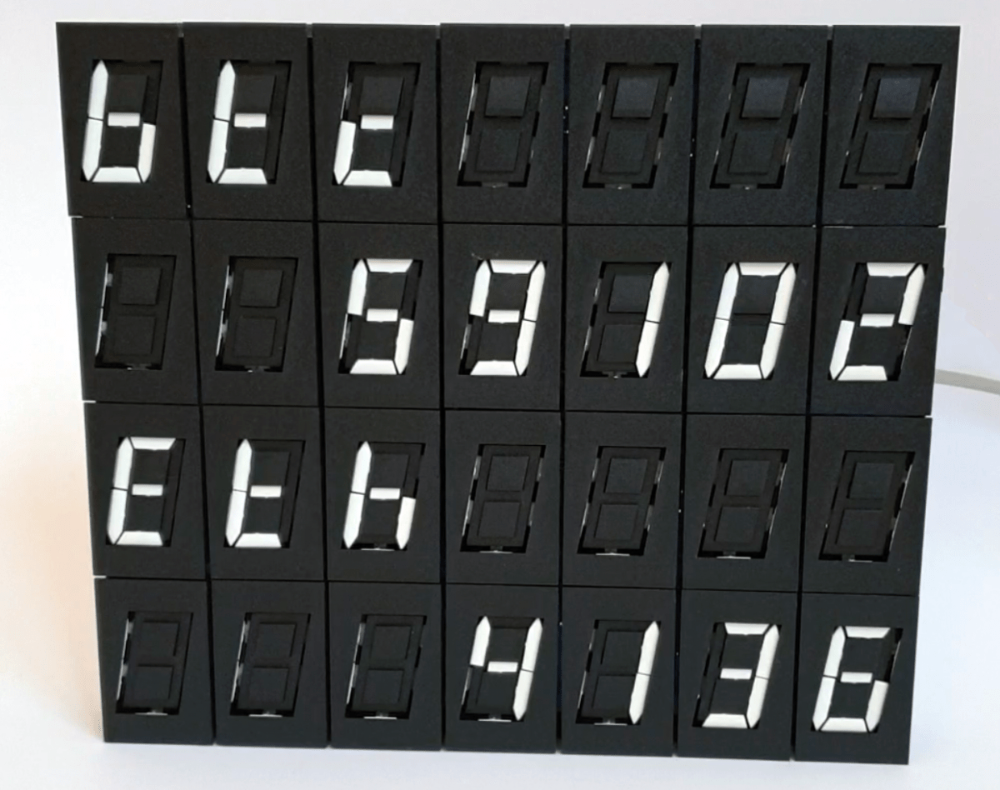
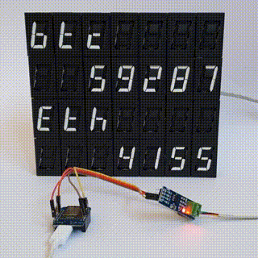
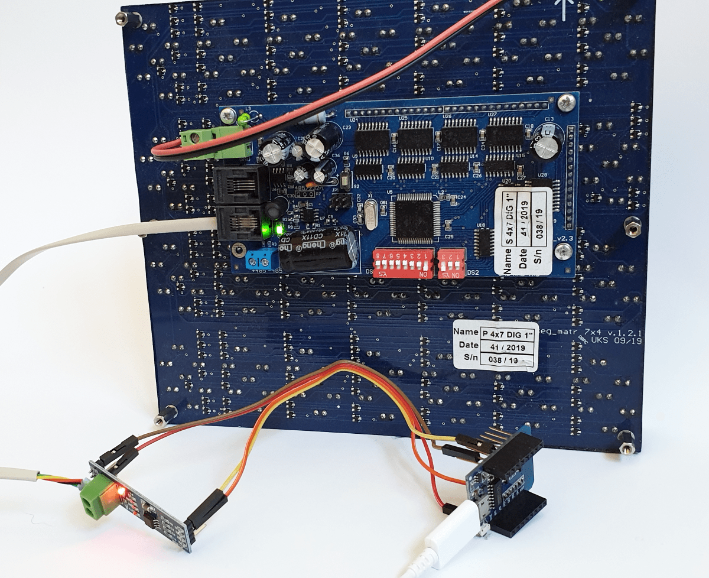
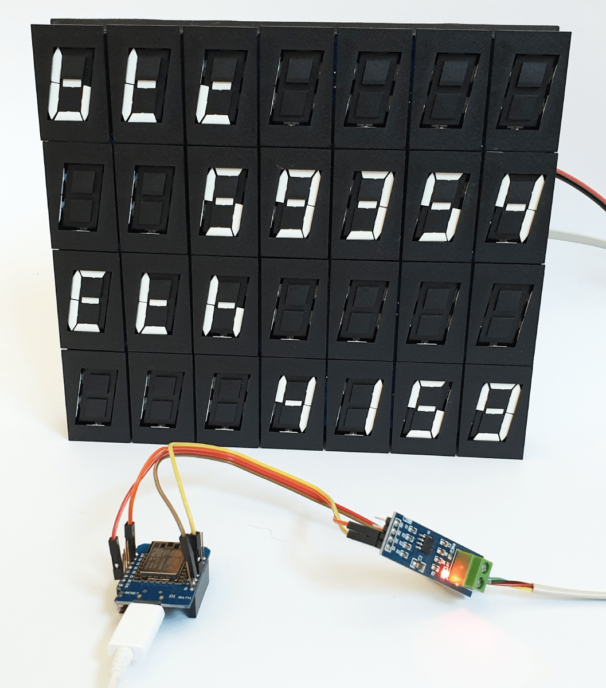

# Real-time crypto tracker on Flip Digit display

Using an Arduino with Wifi, we can connect to a real-time WebSocket crypto feed and output the real-time prices onto a mechanical FlipDigit display. WebSocket API and cryptos to track are all configurable in the code.



## What are Flip Digit displays?
Flip Digits are 7-segment numbers that use small permanent magnetics to flip the segment on/off. Powered by a small electromagnetic to flip it retains its state even after power is disconnected. Read this if you'd like to [know more](https://flipdots.com/en/electromagnetic-flip-disc-technology-how-it-works/).

## Watch & listen
[](https://www.twitter.com/motus_art)

## Equipment
- FlipDigit 7x4 display from [AlfaZeta flipdots.com](https://flipdots.com/)
- ESP8266 D1 mini
- MAX485 RS-485 Module
- PSU 24V 1A

## Wiring & setup
Edit & upload the [Arduino sketch](./FlipDigitTracker/FlipDigitTracker.ino) to the ESP. 

**Arduino => MAX485**
```
3V3 => VCC
G   => G
D3  => D1
D0  => DE
```

**MAX485 => Flip Digits**
```
24V 1A  => VCC  
RS485 A => RS485+
RS485 B => RS485-
```

**Flip Digit panel settings**
```
DIP1: ↑↓↓↓↓↓↓↓ (Id 1)
DIP2: ↓↓↑ (19200 baud rate)
```



## Want to know more?
[Contact me](https://linktr.ee/motus_art) if you have any questions.

---


